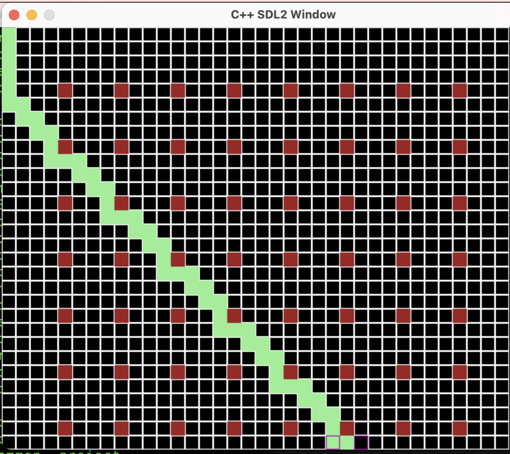

# A* Pathfinding Algorithm with SDL

This project demonstrates the A* pathfinding algorithm using the Simple DirectMedia Layer (SDL) library to provide a graphical interface. The code defines a grid with nodes that can act as obstacles, start points, or end points for the A* algorithm.



## Features

- Custom Priority Queue for A* algorithm
- Obstacle, Start, and Goal can be set dynamically in the GUI

## Prerequisites

- C++ Compiler
- SDL 2.0


## Build Instructions

To build the project, simply run the `build.py` script:

```bash
python build.py
This will compile the project into an executable.
```
## Running the Program
After building, execute the generated binary to start the program. A window should appear displaying a grid that you can edit. Left click to make the destination and Right click to add obstacles.

For more details on the project structure and functionality, refer to the inline comments within the source code.
